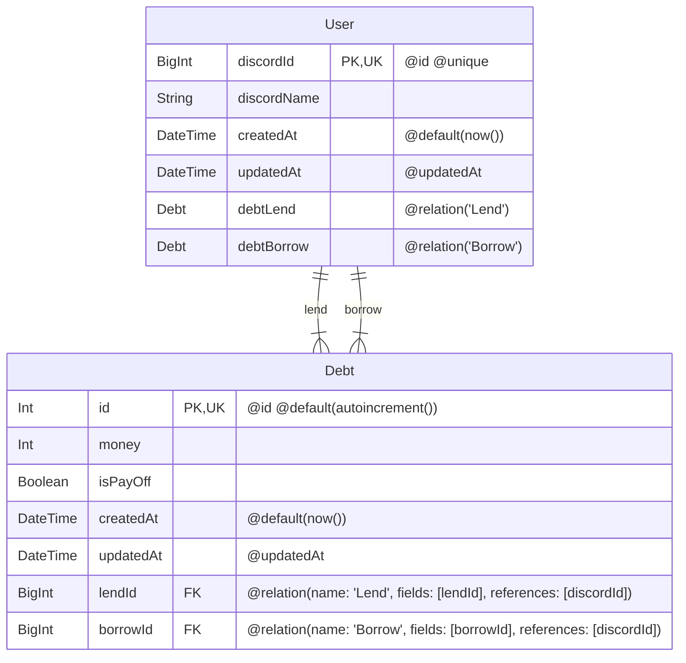

# DebtBot

## bot

-   使用言語: TypeScript
-   discord.js v14 で作成

## backend

-   使用言語: TypeScript
-   WebAPI: Hono
-   ORM: Prisma
-   RDBMS: MySQL

> [!CAUTION]
> プログラムの中に、`console.log()`するべきでない内容を`console.log()`しています。実際にこのプログラムを使用する際は、`console.log()`を全て消してください。

### 使用を推奨しているパッケージマネージャー

-   yarn

## Setup

### windows ユーザー

> [!CAUTION]
> 以下のコマンドたちを実際に実行して試していないので、ご注意ください。

```batch
make-env.cmd
cd bot
yarn
cd ..
cd backend
yarn
#データベースに関する情報を適宜書き換える
yarn migrate
```

### `.env`ファイルの生成

### Batchfile

```batch
make-env.cmd
```

### Shell

> [!CAUTION]
> Linux 環境で実行した際の動作の確認をしていないため正しく動作しない可能性があります。

```shell
bash make-env.sh
```

### bot に置く`.env`ファイルの中身

> [!NOTE]
> 空の文字列(または数字)に適切な情報を入力してください。

> [!CAUTION]
> 　 `.env`ファイルに書く内容は、外部に漏れてはいけない内容なので、必ず`.gitignore`ファイルに`.env`を書いてください。

```.env
TOKEN = ""
APPLICATIONID = ""
GUILDID = ""
REGISTERURL = ""
DELETEURL = ""

```

### backend に置く`.env`ファイルの中身

> [!NOTE]
> 空の文字列(または数字)に適切な情報を入力してください。

> [!NOTE]
> IPADDRESS と PORT は、適宜変えてください。

> [!CAUTION]
> 　`.env`ファイルに書く内容は、外部に漏れてはいけない内容を含むので、必ず`.gitignore`ファイルに`.env`を書いてください。

```.env
IPADDRESS = "127.0.0.1"
PORT = "3000"
CLIENTID = ""
CLIENTSECRET = ""

#以下はPrismaによって自動生成されるの省略
# This was inserted by ~


```

## DebtBot のテーブル設計



## Web API のエンドポイント

#### `/user/register`

-   ユーザーの登録を行うエンドポイント

#### `/user/delete`

-   登録されているユーザーの登録を削除するエンドポイント

#### `/approval`

-   登録されているユーザーと登録されていないユーザーで、返す情報が変わるエンドポイント
